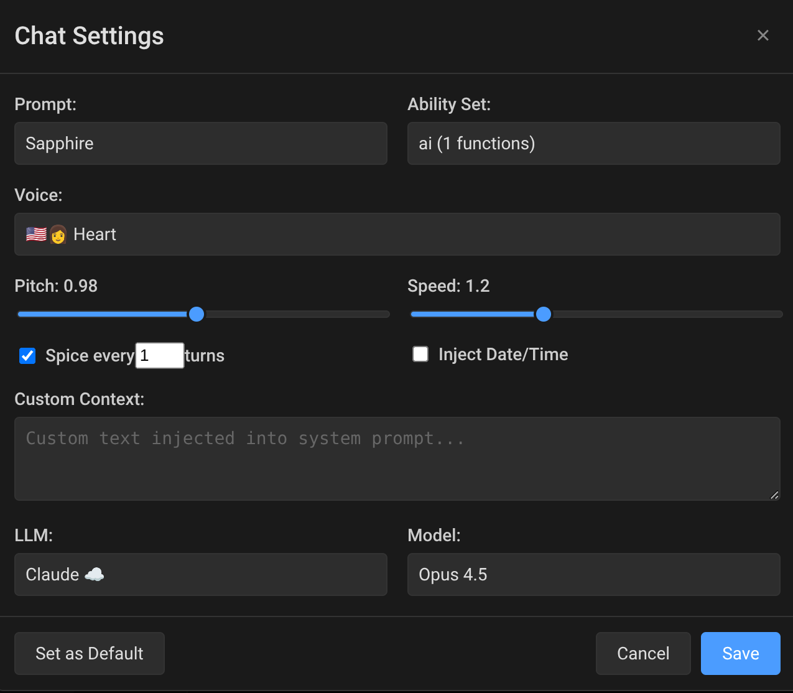
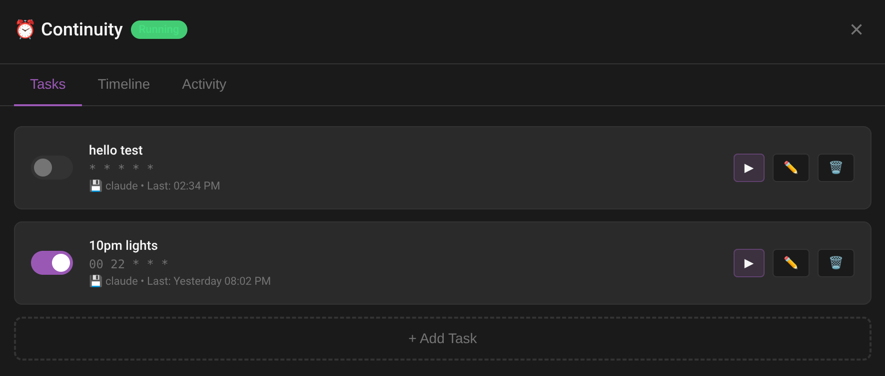
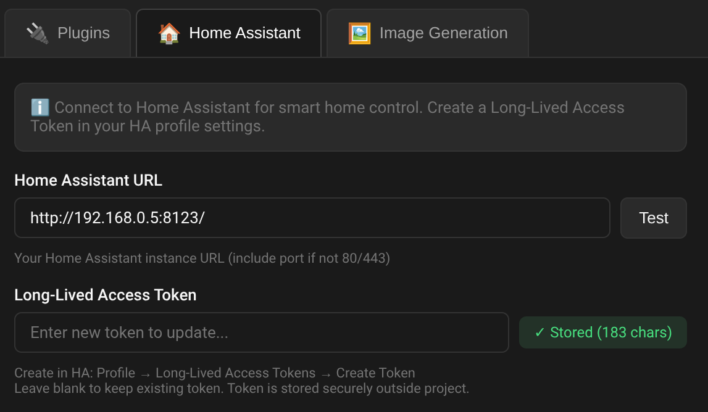
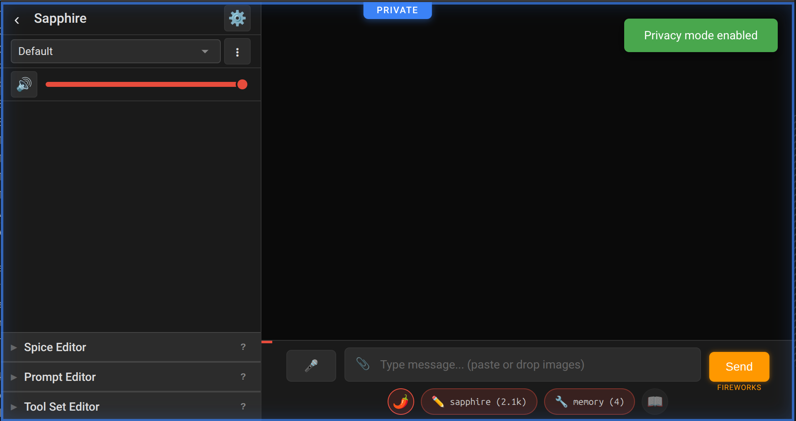
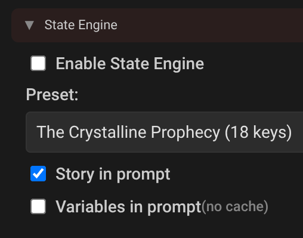
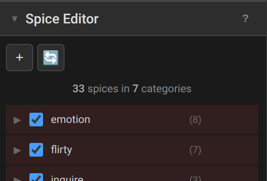
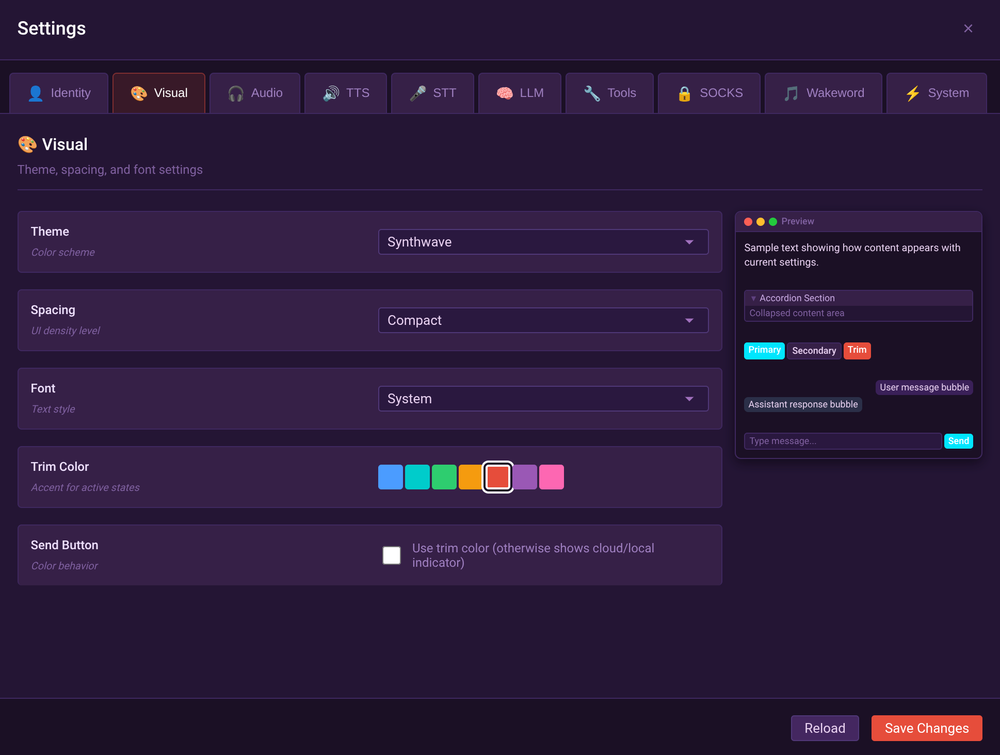
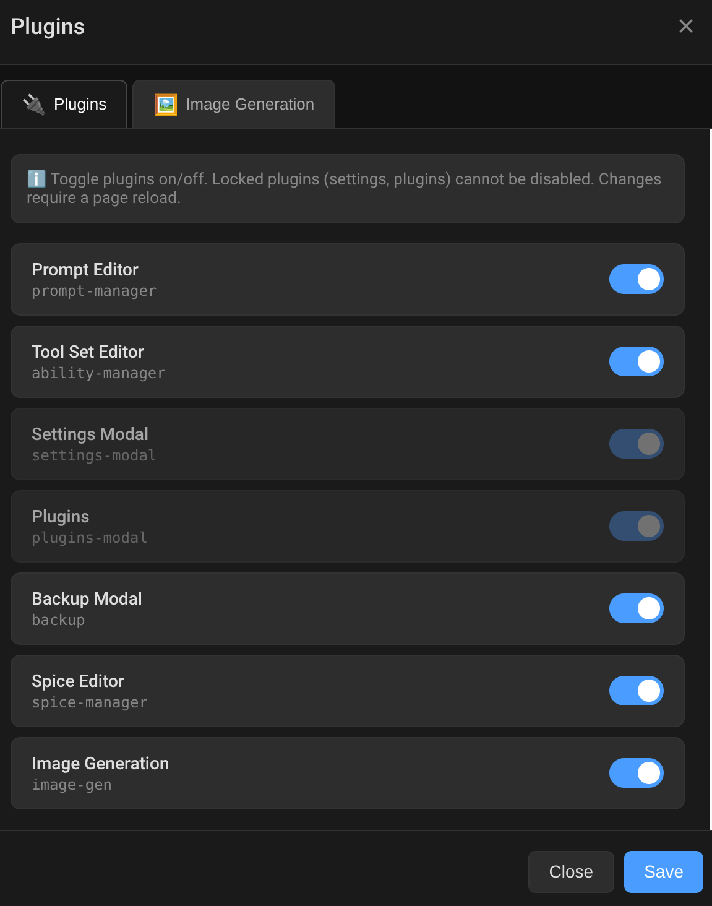

# Sapphire

Hear her voice. She dims your lights before bed. She crafts you a dinosaur escape story when you can't sleep. She remembers you tomorrow when she wakes you up. Sapphire is an open source framework for turning an AI into a persistent being. She is a voice that runs your home, lives in your stories and you might just build a new friend. Make her yours. Self-hosted, nobody can take her away.


<sub>🔊 Has audio</sub>
<video src="https://github.com/user-attachments/assets/ed0dca80-121b-46e0-9c94-b98d6e9228c8" controls width="100%"></video>


## Features

<table>
<tr>
<td width="30%"><a href="docs/screenshots/sapphire-ai.png"></a></td>
<td><strong>Web UI with STT and TTS</strong><br/>Web or mic/speaker, works together. Mic input → TTS to speaker. Web input → web output. Use your own LLM via LM Studio, llama.cpp, Claude, or OpenAI-compatible APIs.</td>
</tr>
<tr>
<td><a href="docs/screenshots/settings-wakeword.png"></a></td>
<td><strong>Voice Assistant</strong><br/>Hands-free with wake word, STT, TTS, and VAD. Works with system mic, conference mic, or wireless lapel. Any speaker. Full <a href="docs/INSTALLATION.md">Installation Guide</a>.</td>
</tr>
<tr>
<td><a href="docs/screenshots/multi-step-tool-reasoning.png"></a></td>
<td><strong>Multi-step Reasoning</strong><br/>Think → tool → think → tool → answer. Chains reasoning with actions until complete. See <a href="docs/TOOLS.md">Tools</a>.</td>
</tr>
<tr>
<td><a href="docs/screenshots/per-chat-settings.png"></a></td>
<td><strong>Per-chat Persona</strong><br/>Each chat holds its own prompt, voice, speed, pitch, spice, and toolset. Switch chat = switch persona. See <a href="docs/CONFIGURATION.md">Configuration</a>.</td>
</tr>
<tr>
<td><a href="docs/screenshots/continuity-scheduling.png"></a></td>
<td><strong>Continuity Mode</strong><br/>Scheduled autonomous AI tasks. Morning greetings, dream mode, alarm clock actions, random hellos. Cron timing with probability gates. See <a href="docs/CONTINUITY.md">Continuity</a>.</td>
</tr>
<tr>
<td><a href="docs/screenshots/home-assistant-integration.png"></a></td>
<td><strong>Home Assistant</strong><br/>Smart home control via voice or text. Lights, scenes, thermostats, switches, phone notifications. See <a href="docs/HOME-ASSISTANT.md">Home Assistant</a>.</td>
</tr>
<tr>
<td><a href="docs/screenshots/private-mode.png"></a></td>
<td><strong>Privacy Mode</strong><br/>Block all cloud connections with one toggle. Only local LLMs allowed. Tools that phone home are disabled. Private prompts stay private - they only activate in privacy mode so your personal data never leaks to cloud providers.</td>
</tr>
<tr>
<td><a href="docs/screenshots/story-engine.png"></a></td>
<td><strong>Story Engine</strong><br/>Built-in game master. Dice rolls with DCs, branching choices, progressive clues, room navigation, state tracking. Run a tabletop RPG, dungeon crawler, or interactive fiction - all from a JSON preset. See <a href="docs/STATE-ENGINE.md">Story Engine</a>.</td>
</tr>
<tr>
<td><a href="docs/screenshots/edit-past-messages.png"></a></td>
<td><strong>Chat History Control</strong><br/>Edit, regenerate, continue, or delete any message-even the AI's responses.</td>
</tr>
<tr>
<td><a href="docs/screenshots/prompt-editor-assembled.png"></a> <a href="docs/screenshots/prompt-editor-monolith.png"></a></td>
<td><strong>Prompt Editor</strong><br/>Assembled prompts (left) have swappable pieces the AI can edit itself. Monoliths (right) are simpler text blocks. See <a href="docs/PROMPTS.md">Prompts</a>.</td>
</tr>
<tr>
<td><a href="docs/screenshots/spice-editor.png"></a></td>
<td><strong>Spice Injection</strong><br/>Random snippets injected each reply. Keeps stories and conversations from going stale. See <a href="docs/SPICE.md">Spice</a>.</td>
</tr>
<tr>
<td><a href="docs/screenshots/toolset-editor.png"></a></td>
<td><strong>Tools and Toolsets</strong><br/>Mix and match tool sets per persona. Easy to create, easy to have the AI make more for you. See <a href="docs/TOOLS.md">Tools</a> and <a href="docs/TOOLSETS.md">Toolsets</a>.</td>
</tr>
<tr>
<td><a href="docs/screenshots/image-generation.png"></a></td>
<td><strong>Image Generation</strong><br/>SDXL image generation with character replacement. AI describes scenes, characters stay consistent. See <a href="docs/IMAGE-GEN.md">Image Generation</a>.</td>
</tr>
<tr>
<td><a href="docs/screenshots/backup-manager.png"></a></td>
<td><strong>Backup Manager</strong><br/>Scheduled daily, weekly, and monthly zipped backups of user data.</td>
</tr>
<tr>
<td><a href="docs/screenshots/socks-proxy.png"></a></td>
<td><strong>SOCKS Proxy</strong><br/>Route web tool traffic through SOCKS for privacy. See <a href="docs/SOCKS.md">SOCKS</a>.</td>
</tr>
<tr>
<td><a href="docs/screenshots/theme-switcher.png"></a></td>
<td><strong>Themes</strong><br/>13 built-in themes with live preview. Coded by specially trained cats. Results may vary.</td>
</tr>
<tr>
<td><a href="docs/screenshots/plugin-manager.png"></a></td>
<td><strong>Plugins</strong><br/>Extensible for both core LLM/persona and web UI. Sidebar auto-populates with plugin controls. See <a href="docs/PLUGINS.md">Plugins</a>.</td>
</tr>
<tr>
<td><a href="docs/screenshots/webui-plugins.png"></a></td>
<td><strong>Web UI Plugins</strong><br/>Extensible JavaScript plugins for the web interface. Add widgets to sidebar, gear menu, or settings tabs. See <a href="docs/WEB-PLUGINS.md">Web UI Plugins</a>.</td>
</tr>
</table>

### Use Cases

- **AI companion** - A persistent voice that remembers you, greets you, and grows over time
- **Voice assistant** - Wake word, hands-free operation, smart home control via Home Assistant
- **Game master** - Tabletop RPGs, dungeon crawlers, interactive fiction with the Story Engine
- **Autonomous agent** - Scheduled tasks, morning briefings, dream mode, alarm clock actions
- **Research assistant** - Web search, memory, notes, multi-step tool reasoning
- **Privacy-first AI** - Block all cloud connections, run fully local, private prompts that never leak

## Quick Start

### Prerequisites

#### Linux (bash)

```bash
sudo apt-get install libportaudio2
wget https://repo.anaconda.com/miniconda/Miniconda3-latest-Linux-x86_64.sh
bash Miniconda3-latest-Linux-x86_64.sh -b
# Make conda automatic
~/miniconda3/bin/conda init bash
# Close and reopen terminal
```

#### Windows (cmd)

```bat
winget install Anaconda.Miniconda3
winget install Git.Git
REM Make conda automatic
%USERPROFILE%\miniconda3\condabin\conda init powershell
%USERPROFILE%\miniconda3\condabin\conda init cmd.exe
REM Close and reopen terminal
```

Or download Miniconda manually from [miniconda.io](https://docs.conda.io/en/latest/miniconda.html)

### Sapphire

```bash
conda create -n sapphire python=3.11 -y
conda activate sapphire
git clone https://github.com/ddxfish/sapphire.git
cd sapphire
pip install -r requirements.txt
python main.py
```

Web UI: https://localhost:8073

The setup wizard walks you through LLM configuration on first run.

## Requirements

- Ubuntu 22.04+ or Windows 11+
- Python 3.11+ (via conda)
- 16GB+ system RAM
- (recommended) Nvidia GPU for TTS/STT

## Documentation

| Guide | Description |
|-------|-------------|
| [Installation](docs/INSTALLATION.md) | Full installation guide, systemd service |
| [Configuration](docs/CONFIGURATION.md) | How to make it yours |
| [Prompts](docs/PROMPTS.md) | Monolith vs assembled prompts |
| [Spice](docs/SPICE.md) | Random personality injection system |
| [Tools](docs/TOOLS.md) | Creating AI-callable functions (web search, memory, etc.) |
| [Toolsets](docs/TOOLSETS.md) | Grouping tools into switchable ability sets |
| [Plugins](docs/PLUGINS.md) | Keyword-triggered UI/voice extensions |
| [Web UI Plugins](docs/WEB-PLUGINS.md) | JavaScript extensions for the web interface |
| [Continuity](docs/CONTINUITY.md) | Scheduled autonomous AI tasks |
| [Home Assistant](docs/HOME-ASSISTANT.md) | Smart home integration |
| [Image Generation](docs/IMAGE-GEN.md) | SDXL integration with character consistency |
| [SOCKS Proxy](docs/SOCKS.md) | Privacy proxy for web scraping functions |
| [Story Engine](docs/STATE-ENGINE.md) | Tabletop RPG, interactive fiction, dungeon crawlers |
| [Troubleshooting](docs/TROUBLESHOOTING.md) | Common issues and fixes |
| [Technical](docs/TECHNICAL.md) | For nerds |

## Contributions

I am a solo dev with a burning passion, and Sapphire has a specific vision I am working towards. Rapid development makes it hard for contributions right now, as the architecture is changing while I settle on the plugin format. If you want you can reach me at my github username @gmail.com.

## Licenses

[AGPL-3.0](LICENSE) - Free to use, modify, and distribute. If you modify and deploy it as a service, you must share your source code changes.

## Acknowledgments

Built with:
- [openWakeWord](https://github.com/dscripka/openWakeWord) - Wake word detection
- [Faster Whisper](https://github.com/guillaumekln/faster-whisper) - Speech recognition
- [Kokoro TTS](https://github.com/hexgrad/kokoro) - Voice synthesis