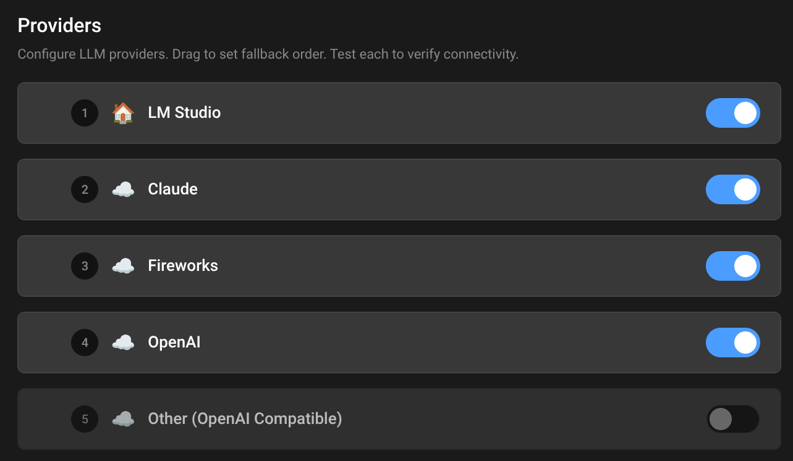

# Configuration

Run the [Installation](INSTALLATION.md) and open Sapphire before you configure. 

## LLM

Your choice of LLM is the biggest factor in Sapphire's persona. Different models have different personalities, strengths, and quirks. The setup wizard configures this on first run, but you can change it anytime in Settings.

Sapphire supports multiple providers with automatic fallback. If your primary LLM fails, it tries the next enabled provider.

### Local LLM (Private)

Run AI on your own hardware. Nothing leaves your machine.

**LM Studio** is the easiest option:
1. Download [LM Studio](https://lmstudio.ai/)
2. Load a model (Qwen3 8B for tools, QWQ 32B for stories)
3. Enable the API in Developer tab
4. Sapphire connects automatically to `http://127.0.0.1:1234/v1`

Local models vary wildly in personality and capability. Experiment to find what fits your persona.

### Cloud LLM (Not Private)

Use powerful cloud models. Your conversations go to external servers.

| Provider | Best For | Notes |
|----------|----------|-------|
| **Claude** (Anthropic) | Complex reasoning, conversation, coding | Most capable overall |
| **OpenAI** (GPT) | General purpose, well-documented | Widely supported |
| **Fireworks** | Fast inference, open models | Good price/performance |

Set API keys via environment variable or Settings → Credentials.

### Per-Chat Model Selection

Each chat can use a different LLM provider. In Chat Settings, the LLM dropdown offers:
- **Auto** — Uses fallback order (tries each enabled provider)
- **LM Studio** — Forces local only
- **Claude/OpenAI/Fireworks** — Forces specific cloud provider

This lets you make Einstein your coder on Claude, and Sapphire your storyteller on local LM Studio.

---

## Make Your Persona

Each chat can have completely different personas, voices, and capabilities. Switch between them instantly.

<table>
<tr>
<td width="33%">

</td>
<td>

### Make the Settings Yours
- Gear icon → App Settings 
- Change names and avatars
- Enable TTS, STT, and Wakeword if desired
- Pick your wake word and raise Recorder Background Percentile if you have webcam mic

</td>
</tr>
<tr>
<td width="33%">

</td>
<td>

### Make the Prompt Yours
- Open the Prompt editor in the sidebar, click **+**
- Choose **Assembled** (more customizable) and name it
- Click **+** next to sections to create new ones:
  - **Persona** - Who the AI is. (You are William AI, a smart coder who...)
  - **Relationship** - Who you are to the AI (I am Jackie, your human boss that...)
  - **Location** - Story location - (You are in a forest where...)
  - **Goals** - AI Goals - (Your goals are to cheer up your user by...)
  - **Format** - Story Format - (3 paragraphs of dialog, narration and inner thoughts...)
  - **Scenario** - World Events - (Dinosaurs just invaded the mainland and...)
  - **Extras** - Optional - Swap multiple in: (sapphire-aware, your hobbies, uncensored)
  - **Emotions** - Optional - Multiple emotions: happy, curious, loved
- Save with the disk icon

Note: Write prompt from first person. You should refer to yourself as "I" in prompts, refer to your AI as "You".

</td>
</tr>
<tr>
<td width="33%">

</td>
<td>

### Set Up Your Default Chat Settings 
- Open the default chat (upper left), click **... → Chat Settings**
- Select your preferred prompt
- Choose which LLM provider to use (Auto, local, or specific cloud)
- Choose which tools the AI can use
- Set TTS voice, pitch, speed. (try: Heart, Sky, Isabella)
- **SPICE** adds randomness to replies
- **Inject Date** lets the AI know the current date
- **Custom text** is always included in addition to system prompt
- Click **Set as Default** then **Save**

Note: Set as Default is for all future chats. Save is for this chat only. Each chat has its own settings.

</td>
</tr>
<tr>
<td width="33%">

</td>
<td>

### Make Multiple Personas
- Click **...** next to any chat name → **New chat**
- Configure that chat differently via **... → Chat Settings**
- Each chat maintains its own prompt, voice, LLM, and tool configuration
- Change the voice, toolset, prompt, LLM provider and save it

</td>
</tr>
</table>

---

## Privacy Mode

Privacy Mode blocks all outbound cloud connections, keeping conversations local-only.

**What it does:**
- Blocks cloud LLM providers (Claude, OpenAI, Fireworks)
- Allows local providers (LM Studio on localhost)
- Blocks tool calls that require external network access
- Only allows endpoints on the whitelist (localhost, LAN IPs)

**How to enable:**
- Settings → toggle Privacy Mode
- Or set `START_IN_PRIVACY_MODE: true` in `user/settings.json`

**Note:** Model downloads (wakeword, STT) still work on first launch even in privacy mode. Once downloaded, everything runs offline.

---

## Advanced Personalization

### Custom Plugins
Keyword-triggered extensions. Feed [PLUGINS.md](PLUGINS.md) to an AI and drop the output in `user/plugins/`. Can run on keywords, in background, or on schedule.

### Custom Tools
AI-callable functions. Simpler than plugins—they are one file in `user/functions/`. Control your devices, check services, simulate capabilities like email/text. Feed [TOOLS.md](TOOLS.md) to an AI to generate them.

### Custom Wake Word
Drop ONNX models in `user/wakeword/models/`. I trained "Hey Sapphire" in ~2 hours with synthetic data. [Community wakewords](https://github.com/fwartner/home-assistant-wakewords-collection) available.

### Custom Web UI Plugins
Extensible JavaScript plugins for the interface. See [WEB-PLUGINS.md](WEB-PLUGINS.md).

## Reference for AI

Help users configure Sapphire settings and personas.

SETTINGS LOCATION:
- Web UI: Gear icon → Settings (app-wide)
- Chat Settings: ... menu → Chat Settings (per-chat)
- Files: user/settings.json (use UI, not direct edit)

LLM CONFIGURATION:
- Local: LM Studio on port 1234 (private)
- Cloud: Claude, OpenAI, Fireworks (not private)
- Per-chat override: Chat Settings → LLM dropdown
- Auto mode uses fallback order through enabled providers

PER-CHAT SETTINGS:
- Prompt: Which system prompt to use
- LLM: Auto, local, or specific cloud provider
- Toolset: Which tools AI can access
- Voice: TTS voice, pitch, speed
- Spice: Random prompt injection

COMMON TASKS:
- Change AI name: Settings → Identity
- Change voice: Chat Settings → Voice dropdown
- Change LLM: Settings → LLM tab, or Chat Settings for per-chat
- Enable wakeword: Settings → Wakeword → enable, restart

FILES:
- user/settings.json - All settings
- user/prompts/ - Prompt definitions
- user/avatars/ - Custom avatars
- ~/.config/sapphire/credentials.json - API keys (not in backups)