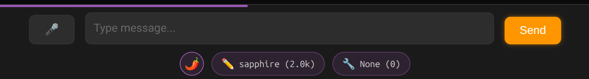

# Spice

Spice prevents stories from going stale and helps avoid loops or repetitive formatting. Spices are random prompt snippets injected into the system prompt, changing each round (or however often you set). This keeps conversations fresh and unpredictable.

## How It Works

1. Create spices in categories via the Spice Manager
2. Enable/disable categories with checkboxes (applies globally)
3. Enable spice for a chat in Chat Settings
4. Each message, one random snippet injects into the prompt
5. Rotates every X messages based on your settings


## Quick Toggle

The hot pepper icon 🌶️ in the input area gives quick access to spice:



- **Hover** — Shows the current spice for last message
- **Click** — Toggle spice on/off for this chat only

## Category Control

Use the checkboxes next to each category to enable or disable entire categories globally. This affects all chats that have spice enabled.

- ✅ Checked categories contribute to the spice pool
- ⬜ Unchecked categories are excluded

## Example Spices

```json
{
  "storytelling": [
    "Something unexpected is about to happen.",
    "Reference a new character.",
    "The weather shifts dramatically.",
    "An old memory surfaces.",
    "Someone is not who they seem."
  ],
  "formatting": [
    "Use 2 paragraphs for this reply.",
    "Use 4 paragraphs for this reply.",
    "Include inner thoughts."
  ]
}
```

## Tips

- Keep snippets vague enough to fit any scene
- Short phrases work better than long sentences
- Use categories to organize by purpose (storytelling, formatting, tone)

## Reference for AI

Spice injects random prompt snippets to prevent repetitive outputs.

SETUP:
1. Open Spice Manager (sidebar)
2. Add snippets to categories
3. Enable/disable categories with checkboxes (global)
4. Enable spice in Chat Settings (per-chat)
5. Set rotation interval

QUICK ACCESS:
- Hot pepper icon 🌶️ in input area
- Hover: shows current spice
- Click: toggle spice for this chat

HOW IT WORKS:
- One random snippet injects per interval
- Only enabled categories contribute to pool
- Stored in user/prompts/prompt_spices.json

GOOD SPICES:
- "Something unexpected happens" (vague, fits any scene)
- "Use 3 paragraphs" (format control)
- "An old memory surfaces" (story catalyst)

BAD SPICES:
- "The dragon attacks" (too specific)
- Long paragraphs (bloats prompt)