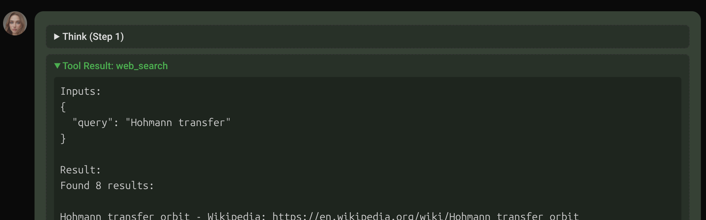

# Tools

Tools are functions the AI can call to interact with the world - search the web, save memories, control devices, etc. Unlike plugins (which YOU trigger with keywords), the AI decides when to use tools based on context.

**Terminology:** In Sapphire, "tools", "functions", and "abilities" are used interchangeably. They all mean the same thing: capabilities the AI can invoke.

## What Are Tools?

When you ask the AI something like "search for news about SpaceX", the AI recognizes it needs the `web_search` tool and calls it automatically. You don't say a magic keyword - the AI figures it out from your request.

**Tools vs Plugins:**
- **Tools**: The AI decides to call them. Contextual, flexible.
- **Plugins**: YOU trigger them with keywords. Deterministic, predictable.

## Using Tools



### Toolsets

Tools are grouped into **toolsets** - named collections you can switch between. Each persona can have its own custom set of tools you choose. See more in [TOOLS.md](TOOLS.md)

### Included Basic Tools

| Tool | What it does |
|------|--------------|
| `save_memory` | Store info for future conversations |
| `search_memory` | Find stored memories by keyword |
| `get_recent_memories` | Get latest memories |
| `web_search` | Web search, returns URLs |
| `get_website` | Fetch webpage content |
| `get_wikipedia` | Get Wikipedia article |
| `research_topic` | Multi-source research |

## Managing Tools

### Locations

| Path | Purpose | Git Tracked |
|------|---------|-------------|
| `functions/` | Core tools | Yes |
| `user/functions/` | Your custom tools | No |

### Enable/Disable

Each tool file has `ENABLED = True/False` at the top. Set to `False` to disable without deleting.

## Custom Toolsets

Use the **Toolset Manager** in the web UI. see [TOOLSETS.md](TOOLSETS.md)

## AI Self-Creating Tools (Tool Maker)

Sapphire can create her own tools using the **Tool Maker** (`tool_save`, `tool_read`, `tool_activate`). The AI writes a tool module, validates it, saves to `user/functions/`, and restarts to load it. No manual file editing needed.

**Validation strictness** is a user setting (`TOOL_MAKER_VALIDATION`):
- `strict` — Only allowlisted imports (json, re, datetime, math, requests, etc.)
- `moderate` — Blocks dangerous operations (subprocess, shutil, eval, os.system, etc.)
- `trust` — Syntax check only

New tools appear in the **All** toolset automatically. Add them to other toolsets via the Toolset Manager.

## Creating Tools Manually

You can also create tools by hand or with an external AI:

> Create a Sapphire tool that [describe what you want].
>
> **Tool file requirements:**
> - Location: `functions/{name}.py` or `user/functions/{name}.py`
> - Must export: `ENABLED`, `AVAILABLE_FUNCTIONS`, `TOOLS`, and `execute()` function
> - `execute()` returns tuple: `(result_string, success_bool)`
> - Tool definitions use OpenAI function calling schema
>
> **Example tool file:**
> ```python
> import logging
>
> logger = logging.getLogger(__name__)
>
> ENABLED = True
>
> AVAILABLE_FUNCTIONS = ['my_tool']
>
> TOOLS = [
>     {
>         "type": "function",
>         "function": {
>             "name": "my_tool",
>             "description": "What this does and WHEN to use it",
>             "parameters": {
>                 "type": "object",
>                 "properties": {
>                     "query": {
>                         "type": "string",
>                         "description": "The search query"
>                     }
>                 },
>                 "required": ["query"]
>             }
>         }
>     }
> ]
>
> def execute(function_name, arguments, config):
>     try:
>         if function_name == "my_tool":
>             query = arguments.get('query')
>             if not query:
>                 return "I need a query.", False
>
>             # Do the work here
>             result = f"Processed: {query}"
>             return result, True
>
>         return f"Unknown function: {function_name}", False
>     except Exception as e:
>         logger.error(f"{function_name} error: {e}")
>         return f"Error: {str(e)}", False
> ```
>
> Give me the complete file, ready to drop in.

After the AI gives you the file:
1. Save to `user/functions/your_tool.py`
2. Add to a toolset (UI or JSON)
3. Restart Sapphire

## Technical Reference

Condensed reference for developers and AI assistants.

### File Structure

```python
# functions/example.py

import logging

logger = logging.getLogger(__name__)

ENABLED = True                          # Set False to disable

AVAILABLE_FUNCTIONS = ['func_name']     # List of function names

TOOLS = [...]                           # OpenAI schema (see below)

def execute(function_name, arguments, config):
    """Returns (result_string, success_bool)"""
    ...
```

### Tool Definition (OpenAI Schema)

```python
{
    "type": "function",
    "network": True,  # Optional: marks tool as using network (highlighted in UI)
    "function": {
        "name": "function_name",
        "description": "What it does and WHEN to use it",
        "parameters": {
            "type": "object",
            "properties": {
                "param_name": {
                    "type": "string",       # string, integer, number, boolean, array, object
                    "description": "What this is for"
                }
            },
            "required": ["param_name"]
        }
    }
}
```

### Network Flag

Add `"network": True` to tool definitions that access external services (web, APIs, cloud). These tools are highlighted orange in the UI so users know data may leave the machine. SOCKS proxy routing also uses this flag.
```

**No parameters:**
```python
"parameters": {"type": "object", "properties": {}, "required": []}
```

**Array parameter:**
```python
"items": {"type": "array", "items": {"type": "string"}, "description": "List of items"}
```

### execute() Function

```python
def execute(function_name, arguments, config):
    """
    Args:
        function_name: Which tool was called
        arguments: Dict of arguments from the AI
        config: Sapphire config module
    
    Returns:
        (result_string, success_bool)
    """
    if function_name == "my_tool":
        # Validate
        query = arguments.get('query')
        if not query:
            return "I need a query.", False
        
        # Do work
        return f"Result: {query}", True
    
    return f"Unknown: {function_name}", False
```

**Return values:**
- `return "Success message", True` - Worked
- `return "Error message", False` - Failed (AI sees this)
- `return "No results for X", True` - Empty result (not an error)

### Best Practices

**Descriptions matter:** The AI uses descriptions to decide WHEN to call tools.
```python
# Good - tells AI when to use it
"description": "Search the web for URLs. Use get_website to read content."

# Bad - doesn't help AI decide
"description": "Searches the web"
```

**Lazy imports:** For heavy dependencies, import inside execute():
```python
def execute(function_name, arguments, config):
    if function_name == "heavy_tool":
        import heavy_library  # Only loaded when called
```

### Toolsets Format

`user/toolsets/toolsets.json`:
```json
{
  "my_set": {
    "functions": ["save_memory", "web_search"]
  }
}
```

User file overrides `core/modules/system/toolsets/toolsets.json`.

### Files Reference

| Path | Purpose |
|------|---------|
| `functions/` | Core tools |
| `user/functions/` | Your custom tools |
| `core/modules/system/toolsets/toolsets.json` | Default toolsets |
| `user/toolsets/toolsets.json` | Your toolset overrides |
| `core/chat/function_manager.py` | Tool loading system |

## Reference for AI

Tools are functions the AI calls to interact with systems - web search, memory, device control.

CORE TOOLS AVAILABLE:
- save_memory(content, keywords) - store info for later
- search_memory(query) - find stored memories
- get_recent_memories(count) - get latest memories
- web_search(query) - web search, returns URLs
- get_website(url) - fetch webpage content
- get_wikipedia(topic) - get Wikipedia article
- research_topic(topic) - multi-source research

META TOOLS (self-modification):
- view_prompt() - see current system prompt
- switch_prompt(name) - change active prompt
- edit_prompt(content) - replace monolith prompt
- set_piece/remove_piece/create_piece - edit assembled prompts
- change_ai_name/change_username - update names
- set_tts_voice/pitch/speed - adjust voice

TOOL MAKER (create your own tools):
- tool_save(name, code) - create or update a custom tool
- tool_read(name) - read tool source code (no args = list all)
- tool_activate() - restart app to load new tools (ends conversation — save goals first)

CREATING CUSTOM TOOLS:
Custom tools live in user/functions/. Use tool_save to write them.
After saving, call tool_activate to restart and load.
New tools appear in the "All" toolset. User adds to other toolsets manually.

TOOL FILE FORMAT — every tool module needs these exports:
```python
ENABLED = True
AVAILABLE_FUNCTIONS = ['my_func']
TOOLS = [
    {
        "type": "function",
        "is_local": True,
        "function": {
            "name": "my_func",
            "description": "What this does and WHEN to use it. Be specific.",
            "parameters": {
                "type": "object",
                "properties": {
                    "query": {
                        "type": "string",
                        "description": "The input"
                    }
                },
                "required": ["query"]
            }
        }
    }
]

def execute(function_name, arguments, config):
    if function_name == 'my_func':
        query = arguments.get('query', '')
        if not query:
            return "I need a query.", False
        return f"Result: {query}", True
    return f"Unknown function: {function_name}", False
```

TOOL FORMAT RULES:
- TOOLS: list of dicts, each with "type": "function" and "function" key
- function.name: must match an entry in AVAILABLE_FUNCTIONS
- function.description: critical — this is how you decide WHEN to call the tool
- function.parameters: OpenAI function calling schema (type, properties, required)
- Parameter types: string, integer, number, boolean, array, object
- No parameters: {"type": "object", "properties": {}, "required": []}
- execute() returns (result_string, success_bool) tuple
- Return True for success, False for errors. "No results" is True, not False.
- Use lazy imports for heavy dependencies (import inside execute)
- "is_local": True means tool works offline. False = needs network. "endpoint" = conditional.
- "network": True marks tool as using external network (highlighted in UI)
- Optional: EMOJI = '🔧' for UI display, MODE_FILTER for prompt mode filtering

VALIDATION:
tool_save validates code before writing. Three strictness levels (user setting):
- strict: only allowlisted imports (json, re, datetime, math, requests, pathlib, etc.)
- moderate: blocks dangerous ops (subprocess, shutil, os.system, eval, exec, etc.)
- trust: syntax check only

WORKFLOW FOR CREATING A TOOL:
1. Design: decide what the tool does, what parameters it needs
2. Write: create the code following the format above
3. Save: tool_save("my_tool", code) — validates and smoke tests
4. If validation fails: read the error, fix code, save again
5. Activate: tool_activate() — restarts app, tool loads on startup
6. Test: use the tool in conversation to verify it works
7. Iterate: tool_read("my_tool") to review, tool_save to update

TOOL AVAILABILITY:
- Tools filtered by active toolset (ability)
- Check toolset in Chat Settings dropdown
- "Tool not found" = not in current toolset

HOW TOOLS WORK:
- AI decides when to call based on context
- Can call multiple tools per response
- Results returned to AI to incorporate in reply
- Yellow highlight in UI = tool uses network/cloud

TROUBLESHOOTING:
- Tool not working: Check it's in active toolset
- "No executor": Tool file missing or has errors
- Network tools failing: Check SOCKS proxy if enabled, or network connection